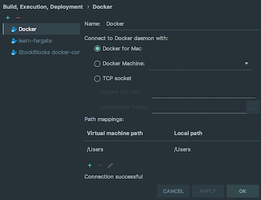
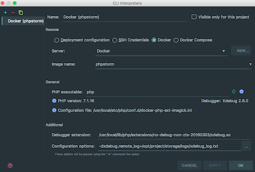
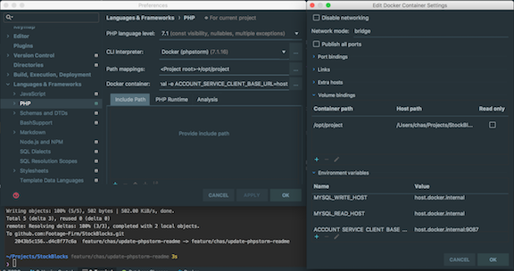
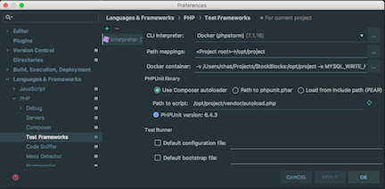

# Dockerfile for PHP Executable

Use this Dockerfile for running php in a development environment.

## Updating the Image
Dockerhub is set to auto-build when the Dockerfile is changed and committed to master.

## Setup PHP and PHPUnit Interpreters for PhpStorm
From PhpStorm we use a docker interpreter to run PhpUnit tests, so you will need a docker image with PHP 7.1 and xdebug installed and then configure PhpStorm to use it.

1. Pull the phpstorm docker image: `$ docker pull videoblocks/docker-php`
1. Open PhpStorm Preferences (`⌘+,`) and navigate to _Build, Execution, Deployment_ > _Docker_.
1. Press `+` to create a new docker configuration. Settings:
    - Name: "Docker Server" (or any name you choose)
    - Connect to Docker daemon with: "Docker for Mac"
    - Path mappings: /Users (Virtual machine path) > /Users (Local path)
    - **OK**

    

1. Open PhpStorm Preferences (`⌘+,`) and navigate to _Languages & Frameworks_ > _PHP_.
1. Click `...` next to _CLI Interpreter_
1. Press `+` to create a new CLI Interpreter and select "From Docker"
1. Create your new remote php CLI Interpreter:
    - Name: "Docker PHP" (or any name you choose)
    - Remote: Docker
    - Server: "Docker Server" (your docker server from above)
    - Image name: "videoblocks/docker-php"
    - PHP executable: "php" (it should recognize php version 7.4.4 and Xdebug 2.9.0 and notify you)
    - Debugger extension: "/usr/local/lib/php/extensions/no-debug-non-zts-20160303/xdebug.so"
    - **OK**

    

1. Back in _Languages & Frameworks_ > _PHP_, set the following:
    - PHP language level: 7.4
    - Path mappings: "<Project root> -> /opt/project"
    - Docker container: _Click `...`_
        - Network mode: bridge
        - Volume bindings: /opt/project (Container path) > <Your project directory> (Host path)
        - Environment variables:
            - DB_HOST: host.docker.internal
            - ACCOUNT_SERVICE_CLIENT_BASE_URL: host.docker.internal:9087
            - AUTH_SERVICE_CLIENT_BASE_URL: host.docker.internal:9087
            - SEARCH_SERVICE_CLIENT_BASE_URL: host.docker.internal:9000

    

1. Open PhpStorm Preferences (`⌘+,`) and navigate to _Languages & Frameworks_ > _PHP_ > _Test Frameworks_.
1. Press `+` to create a new entry and select "PHPUnit by Remote Interpreter". Configure as follows:
    - CLI Interpreter: "Docker PHP" (your remote php CLI Interpreter name)
    - Path mappings: "<Project root> -> /opt/project"
    - Docker container: _Click `...`_
        - Network mode: bridge
        - Volume bindings: /opt/project (Container path) > <Your project directory> (Host path)
        - Environment variables:
            - DB_HOST: host.docker.internal
            - ACCOUNT_SERVICE_CLIENT_BASE_URL: host.docker.internal:9087
            - AUTH_SERVICE_CLIENT_BASE_URL: host.docker.internal:9087
            - SEARCH_SERVICE_CLIENT_BASE_URL: host.docker.internal:9000
    - PHPUnit library: "Use Composer autoloader"
    - Path to script: "/opt/project/vendor/autoload.php" (it should recognize PHPUnit version 8.5.8 and notify you)
    - **OK**

    
